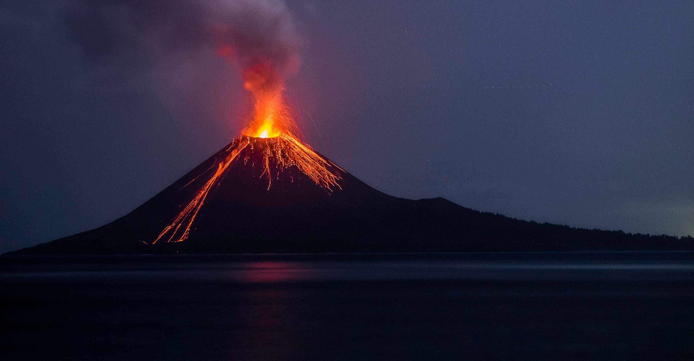

# VolcaNet: Deep Learning for Volcanic Activity Detection

## Repository Link

[https://github.com/thsator/sat-imagery-ml]

## Description

VolcaNet addresses the challenge of timely and accurate detection of volcanic activity using satellite imagery. By leveraging deep learning techniques — specifically convolutional neural networks (CNNs) — our approach analyzes multispectral satellite data, including thermal bands, to identify early signs of volcanic eruptions. This automated system aims to support environmental monitoring efforts and improve early warning capabilities through scalable, data-driven analysis.

Download link for self-collected satellite images can be found in the releases:  
https://github.com/thsator/sat-imagery-ml/releases/tag/v1.0

### Task Type

Image Classification

### Results Summary

- **Best Model:** MobileNetV2
- **Evaluation Metric:** Accuracy, Precision, Recall, F1 Score
- **Result:** Accuracy: 97%, Precision: 100%, Recall: 93%, F1 Score: 96%

## Documentation

1. **[Literature Review](0_LiteratureReview/README.md)**
2. **[Dataset Characteristics](1_DatasetCharacteristics/preprocess_eruption_dates.ipynb)**
3. **[Baseline Model](2_BaselineModel/baseine_model_mobilenetv2.ipynb)**
4. **[Model Definition and Evaluation](3_Model/model_definition_evaluation.ipynb)** 
5. **[Presentation](4_Presentation/README.md)**

## Cover Image

